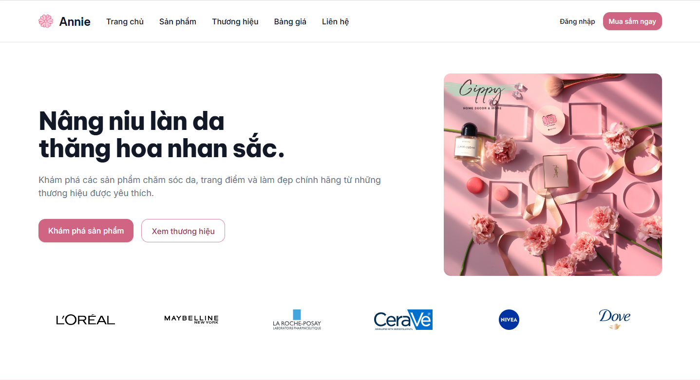

# ANNIE - Beauty & Skincare Website

Website giới thiệu các sản phẩm chăm sóc da, trang điểm và làm đẹp,
được xây dựng bằng HTML và Tailwind CSS.

## Công nghệ sử dụng

- HTML5
- Tailwind CSS
- Git & GitHub

## Các trang

- `index.html` - Trang chủ
- `pricing.html` - Bảng giá và so sánh sản phẩm
- `contact.html` - Trang liên hệ

## Tính năng

- Responsive theo hướng mobile-first
- Hỗ trợ Dark Mode bằng Design Tokens
- Sử dụng reusable components với `@layer components`
- Bảng so sánh có thể cuộn ngang trên mobile
- Form hỗ trợ keyboard focus và accessibility

Public URL:(https://vananh1609.github.io/tkw_2354050003_vananh/)

## So sánh Figma và Website

| Figma sau khi cập nhật           | Website sau khi hoàn thiện           |
| -------------------------------- | ------------------------------------ |
|  |  |

## Nếu có thêm thời gian

Header và Footer hiện đang được lặp lại trong `index.html`,
`pricing.html` và `contact.html` vì dự án sử dụng HTML tĩnh.

Nếu có thêm thời gian, em sẽ tách Header và Footer thành component
dùng chung để dễ bảo trì và cập nhật hơn.
